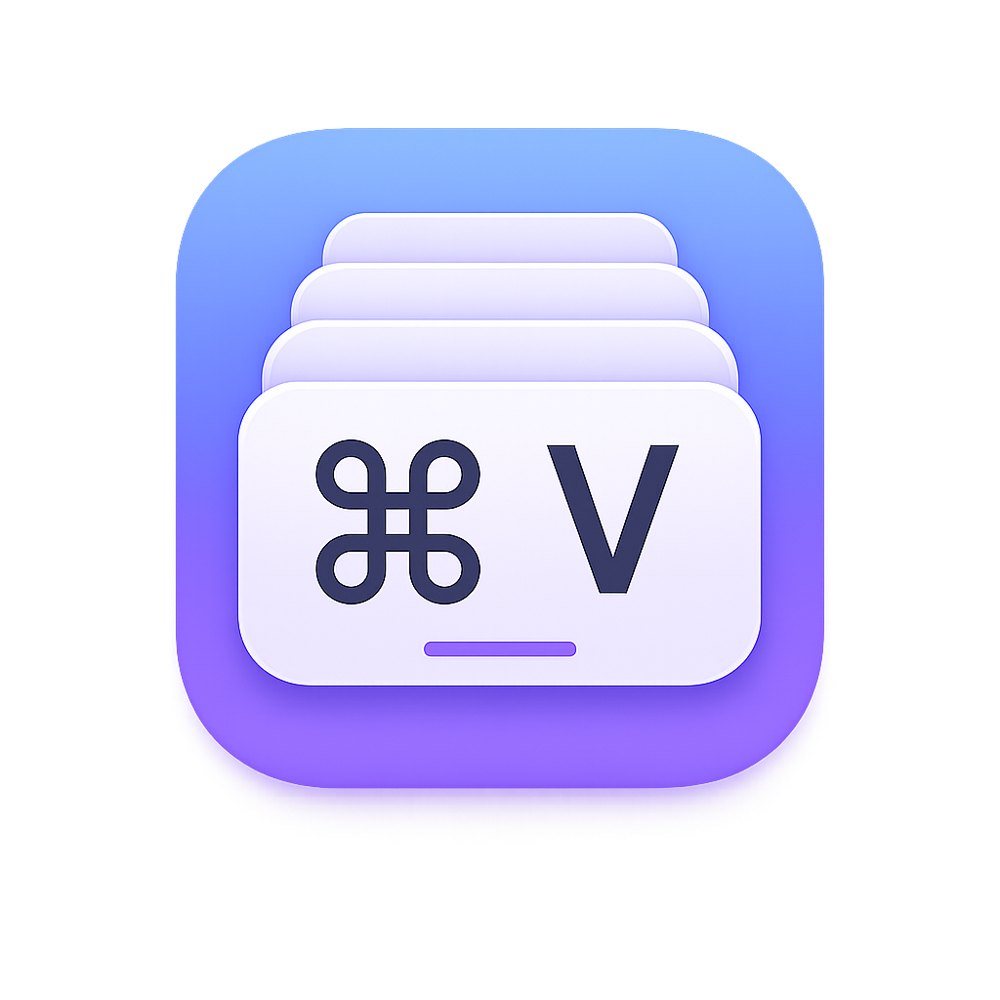
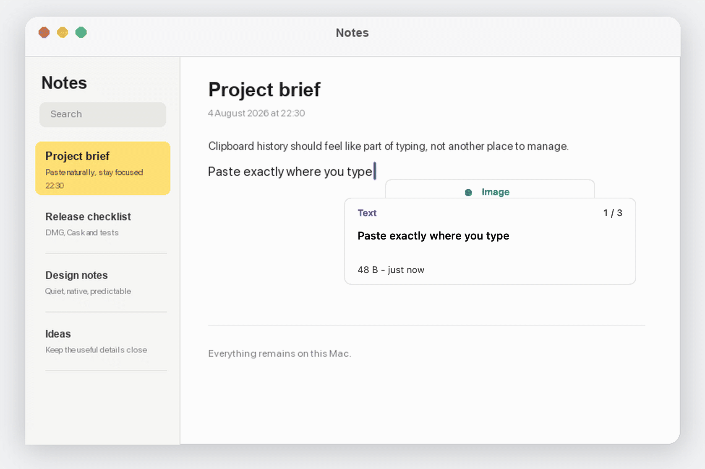
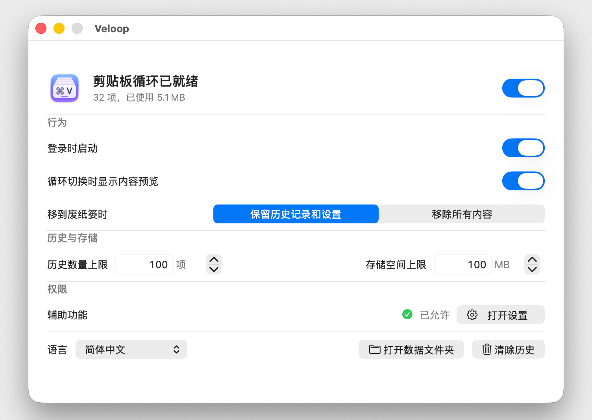

<div align="center">
  <br>
  <strong>Veloop</strong><br>
  <sub>让本地剪贴板历史自然出现在当前输入位置。</sub>
  <p>
    
    
    
    
    
  </p>
  <p><a href="../README.md">English</a> · 简体中文</p>
  
  <p><code>⌘V</code> 打开 · <code>⌘↑</code> 更旧 · <code>⌘↓</code> 更新 · 松开 <code>⌘</code> 粘贴</p>
</div>

Veloop 是一款原生 macOS 剪贴板历史应用。捕获、存储、预览与恢复全部
留在本机，历史记录显示在当前文本光标旁，同时不会抢走当前应用的焦点。

## 亮点

- 忠实保留可以读取的 pasteboard item，包括富文本、图片、文件、文件夹和自定义类型。
- 在当前插入位置旁显示非激活式 Focus Stack。
- 本地保存历史，并可配置条数与存储空间上限。
- 安静驻留后台，没有 Dock 图标、菜单栏项目、分析、云同步或网络监听。

<div align="center">
  
</div>

## 安装

### Homebrew

```bash
brew tap talentdedcat/Veloop https://github.com/talentdedcat/Veloop.git
brew trust --tap talentdedcat/Veloop
brew install --cask Veloop
```

### DMG

[下载 `Veloop-0.2.0-universal.dmg`](https://github.com/talentdedcat/Veloop/releases/download/v0.2.0/Veloop-0.2.0-universal.dmg)，
打开后将 `Veloop.app` 拖入“应用程序”。

> [!IMPORTANT]
> v0.2.0 使用 ad-hoc 签名，尚未经过 Apple 公证。请只对从本仓库安装的
> Veloop 解除隔离，然后启动：
>
> ```bash
> xattr -dr com.apple.quarantine /Applications/Veloop.app
> open /Applications/Veloop.app
> ```

如需登录后自动开始捕获，请在 Veloop 中开启“登录时启动”。

## 使用

1. 按 `Command-V` 在当前光标旁打开历史记录。
2. 按住 Command，按上方向键选择更旧内容，按下方向键选择更新内容。
3. 松开 Command，恢复并粘贴所选内容。
4. 按 Escape 取消，且不改变当前剪贴板。

历史记录到达两端后不会循环。如果当前输入区域没有提供有效光标位置，
Veloop 会保留原有粘贴快捷键的行为。

## 权限

在“系统设置 > 隐私与安全性 > 辅助功能”中开启 **Veloop**。用户只需开启“辅助功能”，
不需要单独开启“输入监控”。

Veloop 不会主动触发 macOS 权限弹窗。“打开设置”在所有权限状态下都可用，
并且只会打开“辅助功能”页面。系统设置处于前台时，状态每 100 毫秒刷新一次；
离开系统设置后立即停止轮询。因此开启或关闭权限无需重启 Veloop。

定位光标时，如果 macOS 已启用随附的 Palette，Veloop 会优先使用它；否则回退到
当前聚焦的 Accessibility 元素。Veloop 不会请求 macOS 启用 Palette。两个来源都
没有提供有效光标矩形时，Veloop 不会拦截原有粘贴操作。

`Veloop.app` 与它的后台进程共享唯一的权限身份和显示名称：`Veloop`
（`com.veloop.app`）。ad-hoc 二进制更新后代码哈希会变化，因此每个更新后的二进制
都需要开启一次“辅助功能”；Veloop 会在启动更新版本前清除自己的旧权限记录。

## 隐私

- 历史记录保存在 `~/Library/Application Support/Veloop/`。
- 日志不包含剪贴板文本、URL、文件名或原始字节。
- 默认跳过隐匿、临时、自动生成和常见密码管理器的剪贴板表示。

Veloop 不上传剪贴板数据，也不会下载剪贴板中的远程 URL。

## 卸载

将 `Veloop.app` 移到废纸篓时，会执行“移到废纸篓时”中选择的策略：

- **保留历史记录和设置**（默认）会移除 Veloop 权限、后台服务和运行文件，
  但保留历史记录与设置。
- **移除所有内容**还会删除历史、设置、偏好、缓存、已存储状态及相关本地数据。

通过 Homebrew 卸载始终会彻底清理：

```bash
brew uninstall --cask veloop
```

等效的直接命令是 `veloopctl uninstall --purge`。

## 命令行

Homebrew 会将 `veloopctl` 加入 `PATH`。通过 DMG 安装时，请使用
`/Applications/Veloop.app/Contents/Resources/veloopctl`。

```bash
veloopctl status
veloopctl pause
veloopctl resume
veloopctl clear
veloopctl count
veloopctl storage
veloopctl doctor
veloopctl config get
veloopctl config set maximumHistoryCount 200
veloopctl open-data-directory
veloopctl uninstall --purge
veloopctl version
```

不带参数运行 `veloopctl` 会输出支持的命令格式。

## 许可证

Veloop 使用 [MIT License](../LICENSE)。
