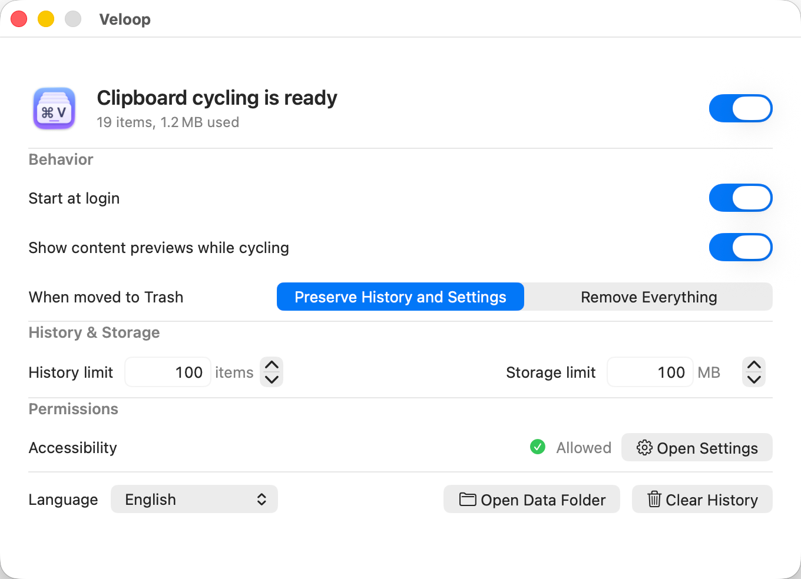

<div align="center">
  <br>
  <strong>Veloop</strong><br>
  <sub>Local clipboard history, exactly where you type.</sub>
  <p>
    
    
    
    
    
  </p>
  <p>English · <a href="Docs/README.zh-CN.md">简体中文</a></p>
  
  <p><code>⌘V</code> open · <code>⌘↑</code> older · <code>⌘↓</code> newer · release <code>⌘</code> to paste</p>
</div>

Veloop is a native clipboard history app for macOS. It keeps capture, storage,
preview, and restoration on your Mac, then presents history beside the active
text caret without taking focus from the current app.

## Highlights

- Faithfully preserves materialized pasteboard items, including rich text,
  images, files, folders, and custom types.
- Opens a nonactivating Focus Stack beside the current insertion point.
- Stores history locally with configurable item and storage limits.
- Runs quietly in the background with no Dock icon, menu bar item, analytics,
  cloud sync, or network listener.

<div align="center">
  
</div>

## Install

### Homebrew

```bash
brew tap talentdedcat/Veloop https://github.com/talentdedcat/Veloop.git
brew trust --tap talentdedcat/Veloop
brew install --cask Veloop
```

### DMG

[Download `Veloop-0.2.0-universal.dmg`](https://github.com/talentdedcat/Veloop/releases/download/v0.2.0/Veloop-0.2.0-universal.dmg),
open it, and drag `Veloop.app` to Applications.

> [!IMPORTANT]
> v0.2.0 is ad-hoc signed and not notarized. Only remove quarantine from a copy
> installed from this repository, then launch it:
>
> ```bash
> xattr -dr com.apple.quarantine /Applications/Veloop.app
> open /Applications/Veloop.app
> ```

Enable **Start at login** in Veloop if you want clipboard capture to start when
you sign in.

## Usage

1. Press `Command-V` to open history beside the active caret.
2. Keep Command held and press Up for older items or Down for newer items.
3. Release Command to restore and paste the selected item.
4. Press Escape to cancel without changing the clipboard.

History stops at both ends. If the focused surface does not expose a valid caret,
Veloop leaves the original paste shortcut unchanged.

## Permission

Enable **Veloop** in **System Settings > Privacy & Security > Accessibility**.
Accessibility is the only permission users need to enable. No separate Input Monitoring setup is required.

Veloop does not trigger the macOS permission prompt. **Open Settings** remains
available in every permission state and only opens the Accessibility pane. The
status refreshes whenever the app becomes active, so grants and revocations are
reported without relaunching the control app.

The caret locator prefers the bundled Palette when macOS already has it enabled,
then falls back to the current focused Accessibility element. Veloop never asks
macOS to enable the Palette. If neither source provides a valid caret rectangle,
Veloop does not intercept the paste.

`Veloop.app` and its background process share one permission identity and display
name: `Veloop` (`com.veloop.app`). Because an ad-hoc binary receives a new code
hash when it changes, Accessibility must be enabled once for each updated binary;
Veloop clears its stale permission records before starting that update.

## Privacy

- History stays under `~/Library/Application Support/Veloop/`.
- Clipboard content, URLs, filenames, and raw bytes are excluded from logs.
- Concealed, transient, auto-generated, and common password-manager clipboard
  representations are skipped by default.

Veloop does not upload clipboard data or download remote clipboard URLs.

## Uninstall

When `Veloop.app` is moved to Trash, the selected **When moved to Trash** policy
is applied:

- **Preserve History and Settings** (default) removes Veloop permissions,
  background services, and runtime files while keeping history and settings.
- **Remove Everything** also deletes history, settings, preferences, caches,
  saved state, and related local data.

Homebrew removal always performs a complete purge:

```bash
brew uninstall --cask veloop
```

The equivalent direct command is `veloopctl uninstall --purge`.

## Command line

Homebrew puts `veloopctl` on `PATH`. With a DMG installation, use
`/Applications/Veloop.app/Contents/Resources/veloopctl`.

```bash
veloopctl status
veloopctl pause
veloopctl resume
veloopctl clear
veloopctl count
veloopctl storage
veloopctl doctor
veloopctl config get
veloopctl config set maximumHistoryCount 200
veloopctl open-data-directory
veloopctl uninstall --purge
veloopctl version
```

Running `veloopctl` without arguments prints the supported command syntax.

## License

Veloop is available under the [MIT License](LICENSE).
